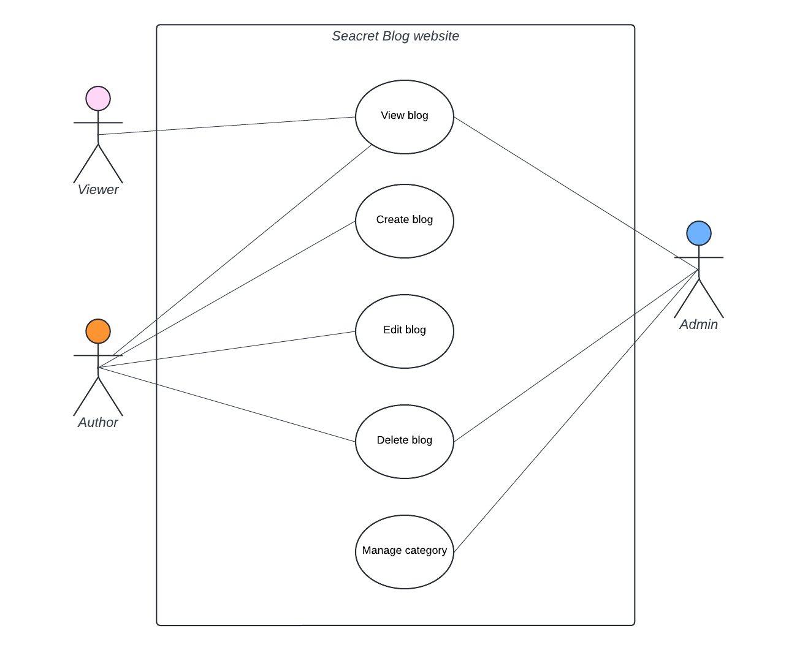
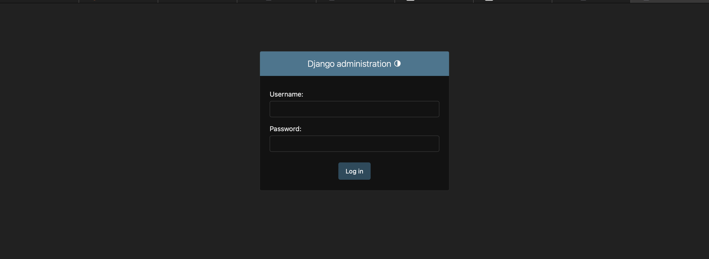
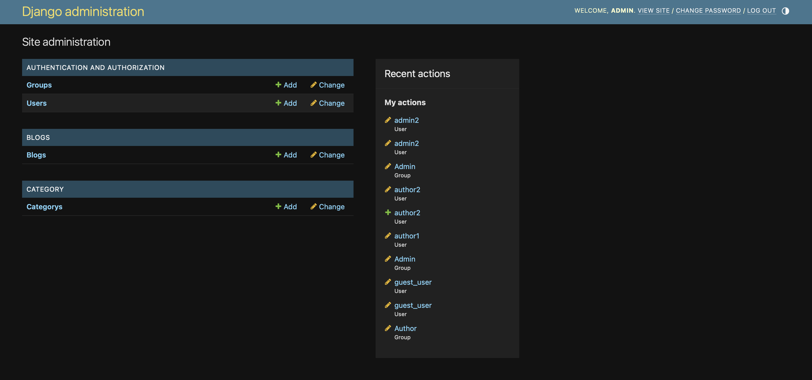
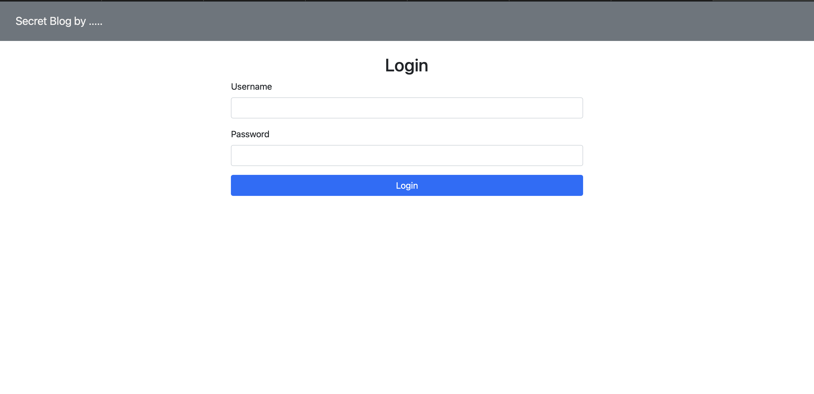
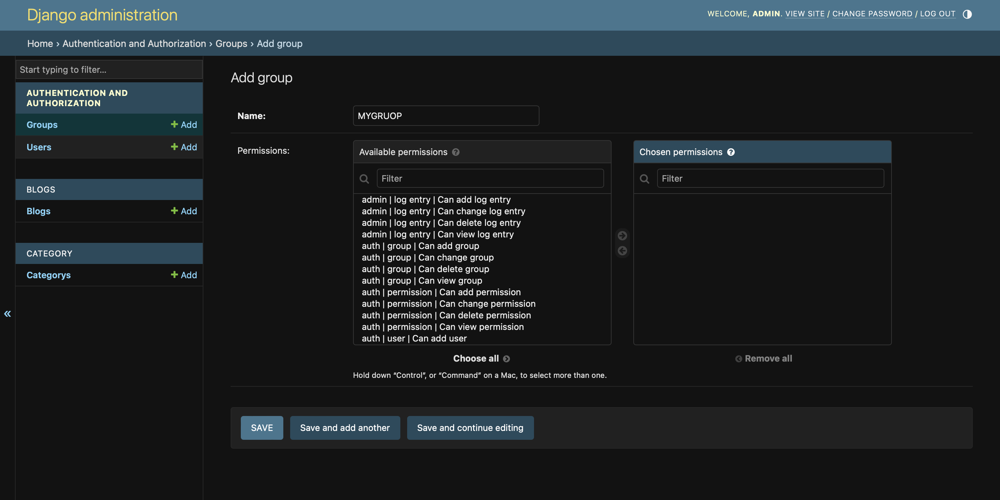
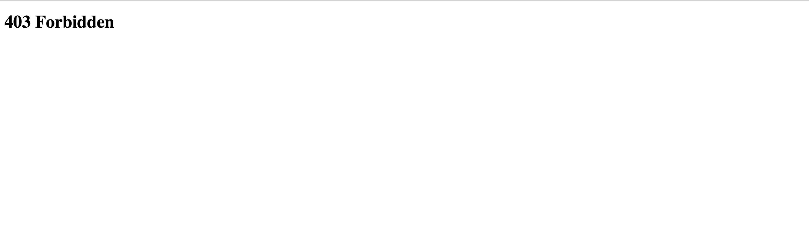
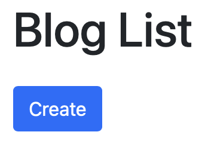
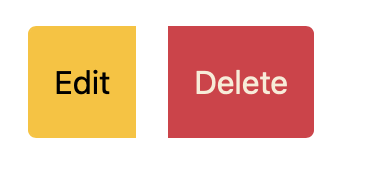

# Week 12 Excercise



### ติดตั้งโปรเจค

1. ให้นักศึกษาโหลดโฟลเดอร์โปรเจค secret_blogs จาก github
    - เมื่อ download ลงมาแล้วสร้าง virtual environment ด้วยคำสั่ง `py -m venv myvenv`
    - Activate virtual environment
    - จากนั้นติดตั้ง `pip install django psycopg2`
    - ติดตั้ง bootstrap5 `pip install django-bootstrap-v5`
2. แก้ไข settings.py

    แก้ไข INSTALLED_APPS

    ```PYTHON
    INSTALLED_APPS = [
        'django.contrib.admin',
        'django.contrib.auth',
        'django.contrib.contenttypes',
        'django.contrib.sessions',
        'django.contrib.messages',
        'django.contrib.staticfiles',
        'bootstrap5',
        'blogs',
        'category',
        'authen'
    ]
    
    ```

    สร้าง database ชื่อ `blogs_db` แก้ไข Setting Database

    ```PYTHON
    DATABASES = {
        "default": {
            "ENGINE": "django.db.backends.postgresql",
            "NAME": "blogs_db",
            "USER": "postgres",
            "PASSWORD": "postgres",
            "HOST": "127.0.0.1",
            "PORT": "5432",
        }
    }
    ```
3. ทำการ makemigrations และ migrate
4. สร้าง superuser ในระบบของเราขึ้นมา 1 account โดยใช้คำสั่ง python manage.py createsuperuser
5. ทดลองใช้เข้าใช้งาน Django admin โดยเข้าไปที่ `http://127.0.0.1:8000/admin/` และ login โดยใช้ user ที่เราสร้างขึ้น



เมื่อ login สำเร็จจะเจอหน้านี้ครับ



## Path 1 Login

1.1 แก้ไข views.py ของทุก app ในโปรเจคของเราให้ต้องมีการ login ก่อนถึงจะสามารถเข้าไปดูเว็บไซต์ได้ถ้า user ยังไม่ login ให้ redirect ไปที่หน้า login page ( "/authen/" ) และเมื่อกด logout บน navbar จะต้อง redirect ไปที่หน้า login (0.5 คะแนน)

> **Hitt: LoginRequiredMixin



1.2 ให้แก้ไขไฟล์ views.py ใน app `authen` ให้ลองรับการ login/logout (0.5 คะแนน)

```PYTHON
    class LoginView(View):
        
        def get(self, request):
            return render(request, 'login.html', {"form": None})
        
        def post(self, request):
            # code here
            pass


    class LogoutView(View):
        
        def get(self, request):
            # code here
            pass
```

## Path 2 Permission

2.1 สร้าง Group ให้กับระบบของเราในเว็บ Django admin โดยมี 3 groups คือ `Admin`, `Author`, `Viewer` โดยให้มี permission ดังนี้ (0.25 คะแนน)

> ถ้านักศึกษาไม่อยากใช้ Django admin สามารถเขียนโค้ดเพื่อสร้าง Group และเพิ่ม Permission แทนได้ครับ [Doc](https://docs.djangoproject.com/en/5.1/topics/auth/default/)

### จากนั้นให้สร้าง User account ให้ group ละ 1 user

```
    Admin:
        - View blog
        - Delete blog
        - View category
        - Add category
        - Change category
        - Delete category
    
    Author:
        - View blog
        - Add blog
        - Change blog
        - Delete blog

    Viewer:
        - View blog

```



2.2 กำหนด permission ให้กับไฟล์ views.py ของ app `blogs` และ `category` ให้ถูกต้อง (0.5 คะแนน)

> **Hitt: PermissionRequiredMixin

ทดลองกด สร้าง ลบ หรือ แก้ไขข้อมูลในเว็บของเราถ้า user ที่ login ไม่สิทธ์จะต้องขึ้นหน้า 403 Forbidden



2.3 ซ่อนปุ่มใน app `blogs` ให้สามารถเห็นและกดได้เฉพาะ user ที่มี permission เท่านั้น (0.25 คะแนน)

> blog_list.html

 

โดยให้ user ที่แก้ไขข้อมูลและลบ blog ได้ต้องเป็นผู้เขียน blog เท่านั้น และถ้า user เป็น role Admin จะสามารถกดลบ blog ได้อย่างเดียว

> blog_detail.html


