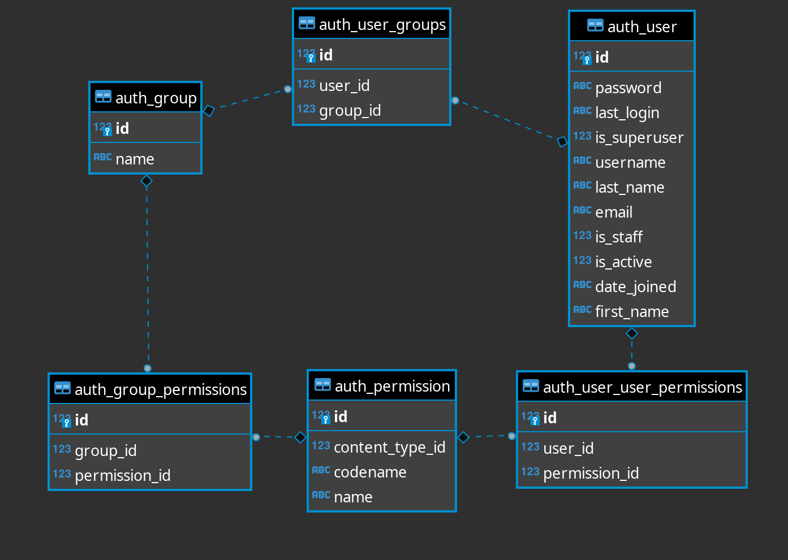

# Permissions and Authorization

[Doc](https://docs.djangoproject.com/en/5.1/topics/auth/default/#permissions-and-authorization)

Django มีระบบ built-in permissions system ซึ่งจะสามารถกำหนด permission ได้ 2 ระดับ:

- ระดับ group ของ user คือสามารถผูก permission เข้ากับ group ของ user ได้ - โดย User object จะมี M2M relationship กับ model `Group` (field User.groups)
- ระดับ user คือสามารถผูก permission เข้ากับแต่ละ user ได้ - โดย User object จะมี M2M relationship กับ model `Permission` (field User.user_permissions)

โดย Django จะทำการสร้าง permission สำหรับ operation CRUD ของแต่ละ model ให้อัตโนมัติเมื่อเราทำการ migrate

ยกตัวอย่างเช่น สำหรับ model `Employee` Django จะสร้าง permissions ให้ 4 ตัว (สามารถดูได้ในตาราง `auth_permission`)

- `employee.view_employee`
- `employee.add_employee`
- `employee.change_employee`
- `employee.delete_employee`

เนื่องจาก User object จะมี M2M relationship - `groups` และ `user_permissions` ดังนั้นการ add/remove relationships สามารถทำได้ดังตัวอย่าง

```text
// User + Group
myuser.groups.set([group_list])
myuser.groups.add(group, group, ...)
myuser.groups.remove(group, group, ...)
myuser.groups.clear()
// User + Permission
myuser.user_permissions.set([permission_list])
myuser.user_permissions.add(permission, permission, ...)
myuser.user_permissions.remove(permission, permission, ...)
myuser.user_permissions.clear()
// Group + Permission
mygroup.permissions.add(perm1, perm2)
```

และการตรวจสอบว่า user ที่ login นั้นมี permission ที่เหมาะสมหรือไม่สามารถทำได้โดยใช้ method `has_perm()` เช่น

```text
add: user.has_perm('employee.add_employee')
change: user.has_perm('employee.change_employee')
delete: user.has_perm('employee.delete_employee')
view: user.has_perm('employee.view_employee')
```

**Important!!!** การอ้างอิงถึงสิทธิ์ใน Django จะเป็นรูปแบบ `<app label>.<permission codename>` เสมอ

ตัวอย่างการใช้งาน

```python
from django.shortcuts import get_object_or_404, redirect
from django.contrib.auth.decorators import login_required
from django.http import HttpResponseForbidden
from .models import Article

@login_required
def publish_article(request, article_id):
    article = get_object_or_404(Article, id=article_id)
    if request.user.has_perm('app_name.can_publish'):
        article.published = True
        article.save()
        return redirect('article_detail', article_id=article.id)
    else:
        return HttpResponseForbidden("You do not have permission to publish this article.")

```

## ERD for Django authentication and authorization



## Programmatically creating permissions

เราสามารถสร้าง custom `Permission` ได้ ดังในตัวอย่าง

```python
from myapp.models import BlogPost
from django.contrib.auth.models import Permission
from django.contrib.contenttypes.models import ContentType

content_type = ContentType.objects.get_for_model(BlogPost)
permission = Permission.objects.create(
    codename="can_publish",
    name="Can Publish Posts",
    content_type=content_type,
)
```

## The `permission_required` decorator

เราสามารถใช้ decorator `permission_required` ในการเช็คว่า user มีสิทธิ์ในการเข้าถึง view หรือไม่

```python
from django.contrib.auth.decorators import permission_required

@permission_required("polls.add_choice")
def my_view(request):
    ...

# กรณีที่ต้องการระบุว่าให้ redirect ไปหน้าไหนในกรณีที่ user ไม่มี permission
@permission_required("polls.add_choice", login_url="/loginpage/")
def my_view(request):
```

## The `PermissionRequiredMixin` mixin

สำหรับกรณี class-based view นั้นเราสามารถใช้งาน class `PermissionRequiredMixin`


```python
from django.contrib.auth.mixins import PermissionRequiredMixin


class MyView(PermissionRequiredMixin, View):
    permission_required = "polls.add_choice"
    # Or multiple of permissions:
    permission_required = ["polls.view_choice", "polls.change_choice"]
    ...
```
